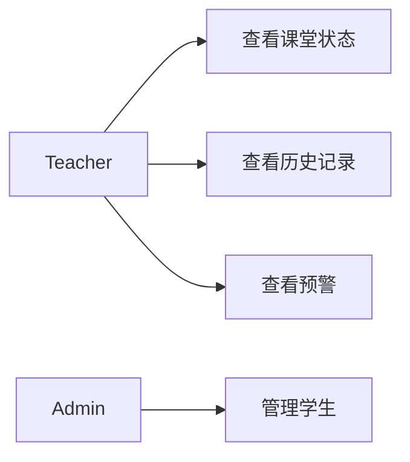

# 用例图

## 1. 系统参与者

- 教师
- 管理员

---

## 2. 用例图

```mermaid
graph LR

Teacher

Admin

View[查看课堂状态]

History[查看历史记录]

Warning[查看预警]

Manage[管理学生]

Teacher --> View
Teacher --> History
Teacher --> Warning

Admin --> Manage
```

---

## 3. 用例说明

教师主要负责查看课堂状态和预警信息。

管理员负责系统配置、学生信息维护及数据管理。