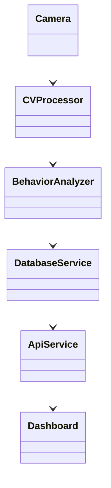

# 类图

## 1. 核心类

```mermaid
classDiagram

class Camera

class CVProcessor

class BehaviorAnalyzer

class DatabaseService

class ApiService

class Dashboard

Camera --> CVProcessor

CVProcessor --> BehaviorAnalyzer

BehaviorAnalyzer --> DatabaseService

DatabaseService --> ApiService

ApiService --> Dashboard
```

---

## 2. 类职责

### Camera

负责视频采集。

### CVProcessor

负责视觉分析。

### BehaviorAnalyzer

负责行为判断。

### DatabaseService

负责数据库操作。

### ApiService

负责REST接口。

### Dashboard

负责数据显示。