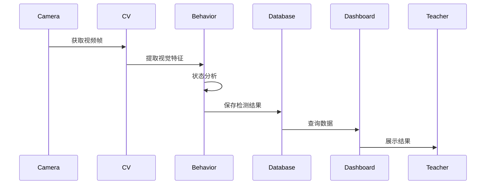

# 时序图

## 1. 学生状态检测流程

```mermaid
sequenceDiagram

participant Camera
participant CV
participant Behavior
participant Database
participant Dashboard

Camera->>CV: 获取视频帧

CV->>Behavior: 提取视觉特征

Behavior->>Behavior: 状态分析

Behavior->>Database: 保存检测结果

Database->>Dashboard: 查询数据

Dashboard->>Teacher: 展示结果
```

---

## 2. 流程说明

整个流程按照实时视频处理顺序执行。

每获取一帧图像后，系统立即完成视觉分析、行为识别和数据保存，再通过接口提供给前端展示。